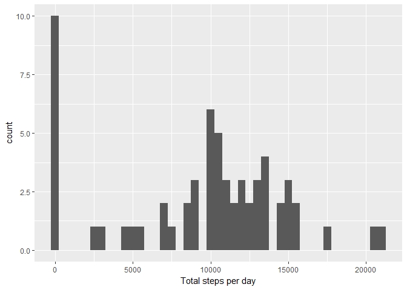
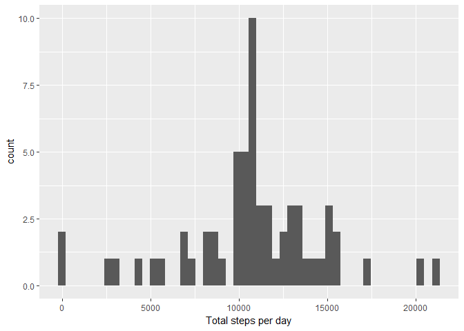

# Reproducible Research: Peer Assessment 1
Jeff Witt  
April 16, 2017  


## Loading and preprocessing the data


```r
library(ggplot2) 
```


```r
if(!file.exists('activity.csv')){
  unzip('activity.zip')
}
activityData <- read.csv('activity.csv',stringsAsFactors=FALSE)
```


convert date character vector to date


```r
activityData$date<- as.Date(activityData$date, format = "%Y-%m-%d")
```


## Total number of steps taken per day
Histogram of the total number of steps taken each day


```r
stepsByDay <- tapply(activityData$steps, activityData$date, sum, na.rm=TRUE)
qplot(stepsByDay, xlab='Total steps per day', binwidth = 500)
```

<!-- -->


##Mean & Median number of steps taken each day

```r
stepsByDayMean <- mean(stepsByDay)
stepsByDayMedian <- median(stepsByDay)
```


##Time series plot of the average number of steps taken

```r
  averages <- aggregate(x = list(steps = activityData$steps), by = list(interval = activityData$interval), 
                      FUN = mean, na.rm = TRUE)

ggplot(data = averages, aes(x = interval, y = steps)) + geom_line() + xlab("5-minute interval") + 
  ylab("average number of steps taken")
```

<!-- -->

##The 5-minute interval that, on average, contains the maximum number of steps

```r
  averages[which.max(averages$steps), ]
```

```
##     interval    steps
## 104      835 206.1698
```


## Code to describe and show a strategy for imputing missing data

```r
missing <- is.na(activityData$steps)
table(missing)
```

```
## missing
## FALSE  TRUE 
## 15264  2304
```


## Histogram of the total number of steps taken each day after missing values are imputed

```r
newactivityData<- activityData
missing_pos <- which(is.na(activityData$steps))
mean_vec <- rep(mean(activityData$steps, na.rm=TRUE), times=length(missing_pos))
newactivityData[missing_pos, "steps"] <- mean_vec

newstepsByDay <- tapply(newactivityData$steps, newactivityData$date, sum, na.rm=TRUE)
qplot(newstepsByDay, xlab='Total steps per day', bins = 50)
```

<!-- -->

## Mean and Median with adjustment in missing data

```r
mean(newstepsByDay)
```

```
## [1] 10766.19
```

```r
median(newstepsByDay)
```

```
## [1] 10766.19
```

##Panel plot comparing the average number of steps taken per 5-minute interval across weekdays and weekends

```r
newactivityData$dateType <-  ifelse(as.POSIXlt(newactivityData$date)$wday %in% c(0,6), 'weekend', 'weekday')

avgnewactivityData <- aggregate(steps ~ interval + dateType, data=newactivityData, mean)
ggplot(avgnewactivityData, aes(interval, steps)) + 
  geom_line() + 
  facet_grid(dateType ~ .) +
  xlab("5-minute interval") + 
  ylab("avarage number of steps")
```

<!-- -->


